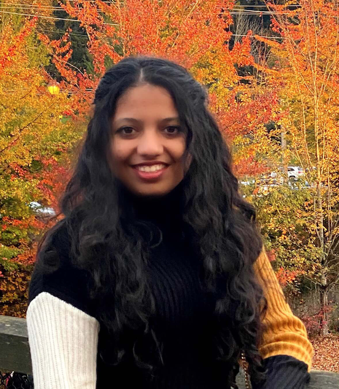

## Hello!

**I am Pankita Tibrewala. I am a third year Mathematics and Computer Science major at *UC San Diego*.**
> I switched my major quite a bit. I came into UCSD as an undeclared majore and then switched to Cognitive Science with specialization in Design and Interaction and now I am a Math-CS major. 

> I interned at E3 Retail this summer

Checkout my [interest and hobbies](#hobbies-and-interests).

Here is my [LinkedIn profile](https://www.linkedin.com/in/pankitatibrewala/)!




### About me:
- international student from India
- 20 years old
- Bilingual
- Vegetarian (trying to be vegan)
- very curious about things


### Hobbies and interests:
1. I love travelling and photography (would love to visit more places soon). [A picture](Nature.jpg) I took while hiking
2. Very interested in human computer interaction and UI/UX design
3. Like fashion and want to learn more about its history
4. I want to learn more languages


### Go to Git commands:
```
git checkout branch_name
git commit
```


### Things to achieve this quarter:
- [ ] Finish all my courses with a good grade
- [ ] Get an internship for next summer
- [ ] Join more clubs to be involved on campus


### Contact

Email: ptibrewa@ucsd.edu

LinkedIn: https://www.linkedin.com/in/pankitatibrewala/
